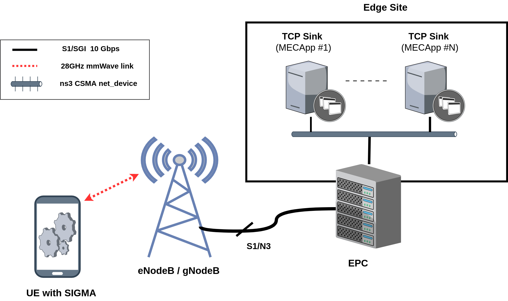

# SIGMA

SIGMA (Simple Increase in Goodput based on MEC Awareness) is a simplistic uplink-oriented Congestion Control Algorithm (CCA) that takes advantage of the known location of the bottleneck (which is the RAN in case of MEC and most CDN scenarios) and the availability of radio information at the UE in order to enhance the uplink TCP performance. At a high level, SIGMA relies on 3 mechanisms or states. It first starts with a mechanism known as Max Start, which allows the SIGMA's sender to
start directly sending at the maximum reachable rate, as opposed to the traditional Slow Start. The Max Start phase lasts 1 RTT and after that the SIGMA's sender oscillates between 2 states : 1) The Proportional Adjustment state, in which the CWND is adjusted proportionally to the ratio of lastRTT over minRTT; 2) The Safe Increase State, during which the released/unused radio BW is discover and used  without creating an excessive buffering in the proces. These machanisms make it possible to maintain a full radio link utilization while avoiding on-device bufferbloat, and this since the very first RTT. As such, SIGMA tremendously improves PLTs and the performance of short-lived flows (which constitute the majority of today's Internet flows)  

 

# 1. Building the simulation environment

## 1.1 Legacy ns3 with mmWave
